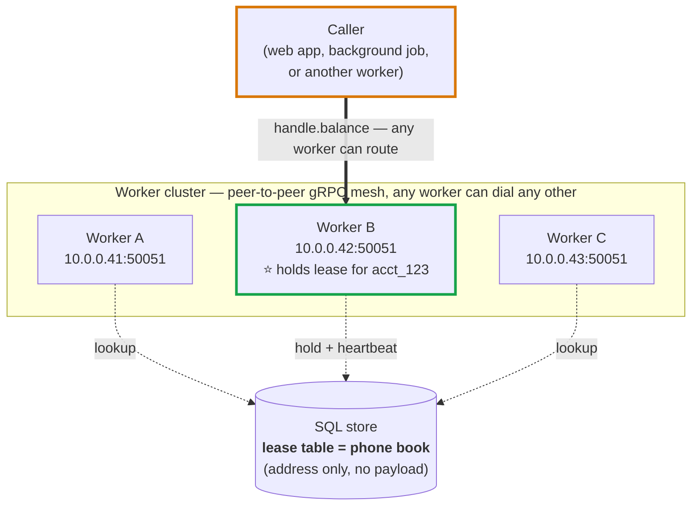
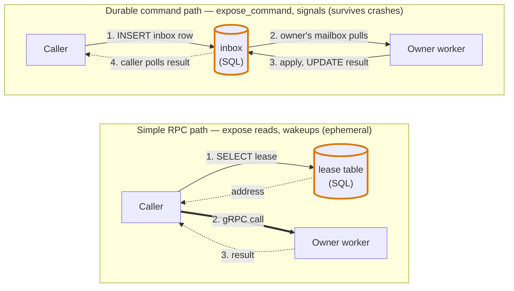
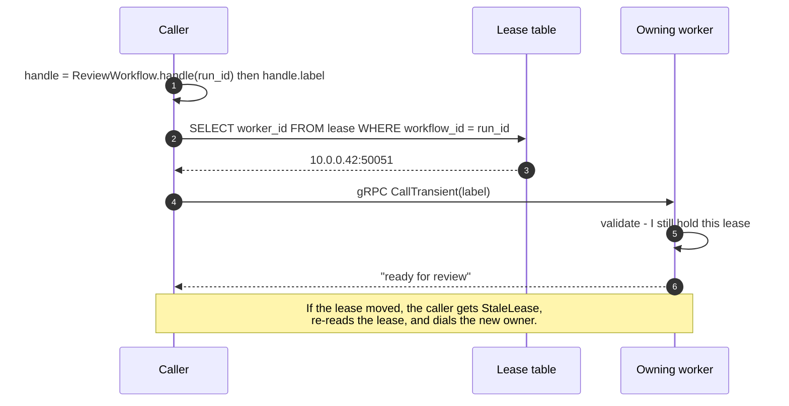

# Cluster RPC

Durababble workers form a peer-to-peer gRPC mesh. When code somewhere in the cluster calls `handle.label` on a workflow handle or reads `account.balance` on a durable object reference, the call is delivered straight to the pod that currently holds the lease for that entity — no database round-trip in the request path. This page explains why that mesh exists, what it is and isn't, and how it stays cheap.

## Two Kinds Of Calls

Durababble has two distinct kinds of cross-process call, and they take very different paths.

- **Durable commands** — `expose_command` mutations and durable workflow signals — are inbox messages. The sender writes a row, the owner's worker consumes that row exactly once, and the result is recorded. They survive crashes, get retried, are guaranteed to be delivered eventually, and are ordered per recipient. They are also intentionally expensive: every command is at least one insert plus one update plus a fence.

- **Simple RPC** — `expose` reads and the live wake-up that gets a freshly-inserted command picked up promptly — does not need any of that. A `balance` query just wants the current state, right now, from whichever worker has it warm. Sending those through the database would mean every status check, every "is this thing still running?", every read against a hot durable object hits SQL and waits behind whatever else is in flight.

The mesh exists so the cheap calls stay cheap. Durable commands still go through the inbox; this page is about everything else.



Every worker runs a gRPC server and can dial every other worker. The SQL store is shared, but only the **lease table** is consulted on the request path — to look up which worker currently owns the target. The payload itself never touches the database.

## Why Not Run Everything Through The Database

Temporal-shaped durable execution platforms tend to route all cross-node traffic through their own control plane, which in turn writes to a backing store. That model is uniform and tidy, but it has costs that show up at scale:

- Every RPC is a write. A status check or a polling read becomes a row in the history table.
- The database becomes the hot path for traffic that does not need to be durable. Read-heavy workloads against durable objects (live counters, "what is the current cursor?") amplify into write-heavy SQL.
- Latency floors are set by the database. A read that could be a 1 ms gRPC call becomes a 10–50 ms round-trip through the orchestration service and storage layer.
- Backpressure and rate limits in the durable layer apply to traffic that should never have touched it.



Both paths end up at the same owning worker, but the durable path persists every step so the message survives crashes, while the simple-RPC path uses SQL only as a lookup and runs the call in-memory.

Durababble's stance is that durable execution is great for things that must survive crashes, and a bad fit for things that are fundamentally ephemeral. The mesh handles the ephemeral half.

## How The Mesh Works

The mesh piggybacks on infrastructure Durababble already needs for correct durable execution: leases.

To execute a workflow or process a durable object's inbox, a worker first claims a lease in the database. The lease row records `worker_id` and `locked_until` so that exactly one worker is doing the work at a time and stale ownership can be fenced. That row is the address book — `worker_id` is set to the worker's reachable gRPC address by default, so any caller that can read the lease can also dial the owner.

A simple call flows like this:

1. Caller has a handle: `ReviewWorkflow.handle(run_id)`.
2. Caller invokes a method: `handle.label`.
3. The router reads `current_workflow_lease(workflow_id)` and gets back the owning worker's id (which is its gRPC address).
4. The router opens (or reuses) a gRPC connection to that address and sends the call.
5. The owning worker validates that it still holds the lease, runs the handler, and returns the result.



If the lease has moved (the owner crashed, the workflow was rescheduled), the caller gets `StaleLease` or `NodeUnavailable` and can retry, which re-reads the lease and dials the new owner. The DB is consulted to find the owner, not to carry the payload.

For durable objects, the same flow applies. `Account.at("acct_123").balance` reads the object's lease, dials the owner, and returns the current state. `Account.at("acct_123").credit(1_000)` writes a row to the object's inbox and waits for the owning worker's mailbox loop to apply it.

## What This Buys

- **No write amplification.** Status reads, live counters, and warm-path RPCs do not write to SQL.
- **Latency is gRPC latency.** Calls land on the lease holder directly; there is no orchestration hop.
- **The DB sees what it has to see.** Workflow history, step results, inbox messages, fences, outbox rows — the things that genuinely need to be durable. Not "what's your status?".
- **No new components to operate.** The mesh is gRPC servers spun up inside the workers you were already running. There is no routing tier, no broker, no service registry. The address book is the lease table.
- **Free fencing.** Because the mesh reads lease rows, a request to a worker that has lost its lease fails fast with `StaleLease` instead of being silently mishandled by a zombie process.

## Wiring It Up

Production workers need a reachable address. The [install instructions](install.md#workers-and-cluster-addresses) cover the `rpc_host` / `rpc_port` arguments to `Durababble::WorkerRuntime`. The short version:

```ruby
Durababble::WorkerRuntime.start(
  store:,
  workflows: [FulfillOrder],
  objects: [Account],
  worker_pool: "orders",
  rpc_host: ENV.fetch("POD_IP"),
  rpc_port: 50_051,
  rpc_credentials: production_grpc_credentials,
)
```

Single-process scripts and tests can stick with `Durababble::Worker.new(...)` and skip the mesh entirely; in that mode RPCs are routed in-process. The mesh only matters when more than one worker is running and they need to address each other.

## What Is Still Aspirational

The gRPC transport, peer routing, lease-keyed addressing, and stale-lease retries are implemented and exercised by the test matrix. mTLS / SPIFFE policy, admin surfaces, and richer health and routing observability for the mesh are target work — see [the reference](reference.md) for the current prototype boundary.
