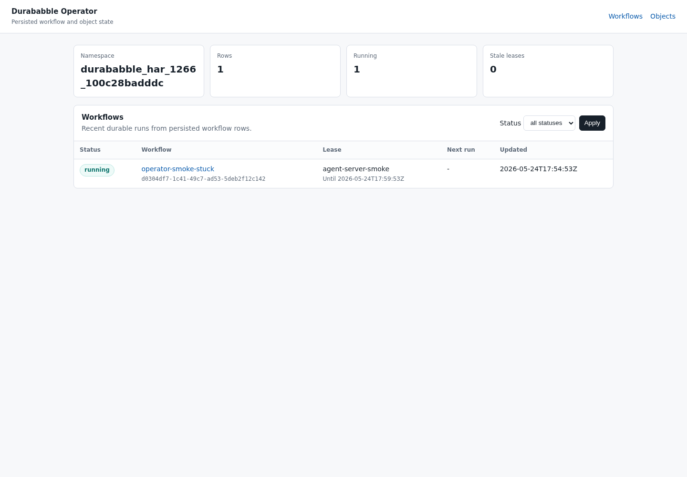
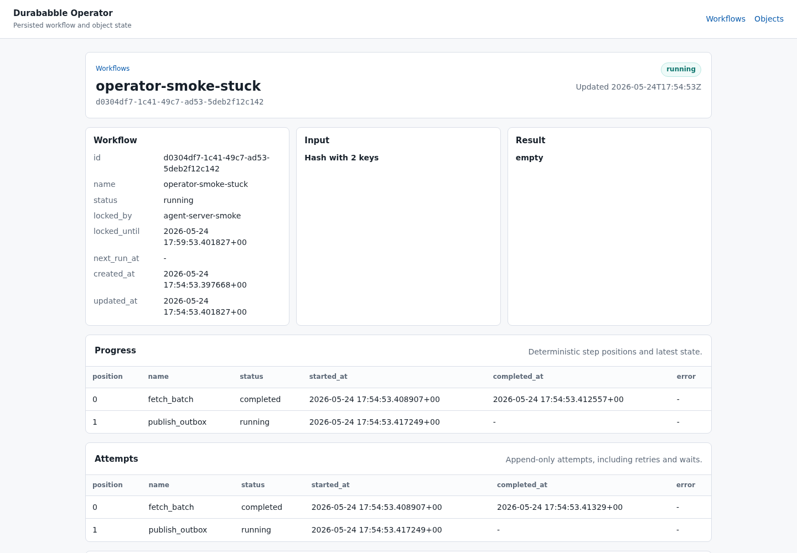
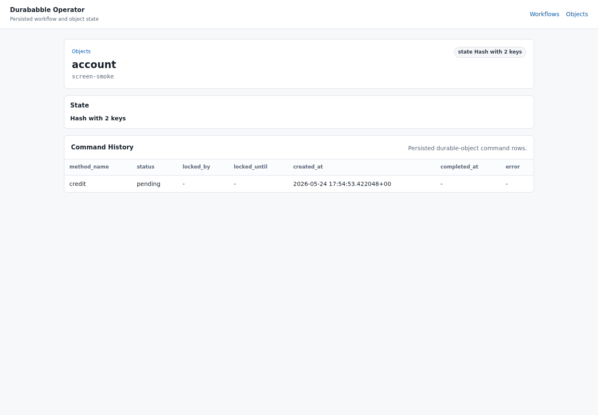

# Operator web UI spec

Status: implementation spec plus prototype read-only UI. This document
specifies the operator-facing web UI and supporting management API that should be
built after the current prototype storage/API gaps are closed. The current repo
also ships `Durababble::Operator::App`, a small Rack-compatible read-only UI for
local smoke testing and host-app mounting.

Durababble already persists workflow runs, steps, attempts, waits, workflow
leases, outbox rows, durable-object state, and transitional durable-object
command rows. The operator UI should expose that durable state without bypassing
the store or adding process-local views of truth.

## Personas

- **Developer operator:** runs Durababble locally or in a staging app, inspects
  stuck runs, verifies waits/events/outbox delivery, and safely replays a
  scenario while developing workflow code.
- **Production on-call:** diagnoses production incidents, confirms whether a
  workflow/object is still owned by a live worker, chooses cooperative recovery
  before destructive action, and leaves an auditable trail.
- **Support engineer:** can inspect status and history for a customer-facing
  object or workflow but cannot mutate execution unless explicitly granted.
- **Runtime maintainer:** uses query-shape and lease views to identify missing
  indexes, hot partitions, stale workers, and backlog growth.

## Deployment assumptions

- The UI is mounted by the host application, for example at
  `/durababble/operator`. The prototype mount surface is
  `Durababble::Operator::App`, a Rack-compatible callable. The host app owns
  routing, session middleware, CSRF protection, and production authentication.
- The UI talks only to a Durababble management API backed by `Durababble::Store`
  reads and writes. It must not inspect Ruby worker memory, in-process caches, or
  local deterministic simulation state.
- Local/dev mode may allow a single unauthenticated loopback-only mount when the
  host app opts in. Production must require host authentication and explicit
  Durababble permissions.
- The API must be namespace-aware. Each request is scoped to the store namespace
  selected by `DURABABBLE_SCHEMA` or `Durababble.workspace_schema`, and the UI
  must display the active namespace in the chrome.
- MySQL/MariaDB and PostgreSQL/YSQL are both supported. Query APIs and indexes
  must be specified through the backend abstraction instead of relying on
  adapter-specific SQL features without conformance tests.

## Security and permissions

Production deployments should default to read-only access until mutating roles
are configured.

The prototype `Durababble::Operator::App` is read-only and deliberately does not
authenticate users. Mount it behind the host app's own authentication and
authorization middleware. In a Falcon-powered Rails app, Falcon serves the Rails
Rack stack, so the operator app can be mounted the same way as any other Rack
callable:

```ruby
# config/routes.rb
mount(
  MyAdminAuthMiddleware.new(Durababble::Operator::App.new(store: Durababble.store)),
  at: "/durababble/operator",
)
```

| Permission | Allows | Denies |
| --- | --- | --- |
| `durababble.read` | Lists, details, timelines, payload metadata, decoded payloads when allowed | All writes |
| `durababble.payload.read` | Decoded inputs/results/state/payloads | Mutations |
| `durababble.workflow.manage` | Workflow cancel, retry/resume, pause/resume | Force termination |
| `durababble.workflow.terminate` | Force workflow termination | Object termination/destruction |
| `durababble.object.manage` | Object pause/resume, command retry, object inspect | Object destroy |
| `durababble.object.destroy` | Destructive object termination/destroy actions | Workflow termination |
| `durababble.admin` | Runtime-wide settings, retention jobs, audit export | Nothing within Durababble |

Payloads can include secrets. The UI should show decoded payloads only to users
with `durababble.payload.read`; other users see type, byte size, serializer
version, and redacted summaries. Every mutating API requires CSRF protection,
host-authenticated user identity, an idempotency key, a reason string, and an
authorization check.

## Prototype smoke screenshots

The current read-only Rack prototype was smoke-tested locally against a real
Durababble store and mounted at `/durababble/operator`.







## Core information architecture

### Workflow list

Route: `GET /durababble/operator/workflows`

Purpose: find workflow executions by health, status, owner, name, age, and
customer/application correlation metadata once available.

Default columns:

- workflow id, workflow name, status, created_at, updated_at
- current worker lease: `locked_by`, `locked_until`, stale/live indicator
- retry due time from `next_run_at`
- current step/wait summary: latest step position/name/status and pending wait
- outbox summary: pending, processing, processed, expired lease counts
- command/inbox summary once workflow inbox exists

Filters:

- status: `pending`, `running`, `waiting`, `failed`, `completed`, `canceled`,
  `terminated`, `paused`
- workflow name, workflow id prefix, worker id, lease state, age range
- due retry, expired lease, pending timer due, pending event wait, outbox backlog

Current store support:

- `Store#workflow(id)` can read one workflow.
- `Store#list_workflows(status:, limit:)` can render the prototype's recent
  workflow list with a status filter.
- Claim paths already query pending/running/failed due rows.

Missing support:

- paginated workflow listing with richer filters and stable cursor ordering
- workflow summary projection with latest step, wait, lease, and outbox counts
- status/index coverage for list filters on both SQL adapters
- optional application correlation metadata columns or tags

### Workflow detail and progress

Route: `GET /durababble/operator/workflows/:workflow_id`

Tabs:

- **Overview:** input/result/error summary, current status, created/updated
  times, lease owner/deadline, next retry, worker pool once persisted, and safe
  available actions.
- **Progress:** ordered durable step positions with method names, statuses,
  attempts, start/complete times, heartbeat cursor presence, and retry schedule.
- **Attempts:** append-only step attempt history, including stale running
  attempts and waits that completed.
- **Waits/timers/events:** pending/completed waits, kind, event key, wake time,
  completion payload metadata, and owning step position.
- **Outbox:** outgoing message topic/key/status, lease owner/deadline, processed
  time, retry/ack history when added.
- **Commands/inbox:** workflow command events today and unified inbox messages
  once implemented.
- **Leases:** current workflow lease, historical lease movements once audit or
  lease history exists.
- **Raw:** decoded fields gated by `durababble.payload.read`, plus redacted
  binary payload metadata for everyone else.

Current store support:

- `Store#workflow(id)`, `Store#steps_for(id)`, `Store#step_attempts_for(id)`,
  and `Store#waits_for(id)`.
- Outbox individual reads through `Store#outbox_message(id)`, and prototype
  detail reads through `Store#list_outbox_messages(workflow_id:, limit:)`.
- Workflow exposed commands currently persist command events through
  `Store#signal_event`.

Missing support:

- list workflow command events by workflow id
- current workflow lease read API suitable for UI summaries
- consistent decoded-payload redaction hooks
- status vocabulary for canceled, terminated, and paused workflows
- workflow history/audit rows for management actions

### Worker and lease state

Route: `GET /durababble/operator/workers`

Purpose: show whether stuck work is genuinely owned, recoverable after lease
expiry, or blocked by a missing node.

Views:

- active workflow leases grouped by worker id and worker pool
- expired workflow leases recoverable by workers
- outbox processing leases and expired outbox leases
- target node registry and RPC address once target node tables exist
- draining/shutdown state once node heartbeat tables exist

Current store support:

- workflow rows and outbox rows include `locked_by` and `locked_until`.
- `Store#steal_expired_leases!` can recover expired workflow leases.
- outbox claim paths recover expired processing leases.

Missing support:

- node registry table and node heartbeat API
- unified leases table for workflows and durable objects
- paginated active/expired lease listing
- lease history for debugging ownership moves

### Durable-object list

Route: `GET /durababble/operator/objects`

Purpose: find durable objects by type/id, update time, command backlog, lease
owner, and state metadata.

Default columns:

- object type, object id, created_at, updated_at
- state size and redacted state summary
- command status counts and head-of-line command
- lock/lease owner once object leasing is hardened
- pending wake/sleep once object sleeps exist

Current store support:

- `Store#object_state(object_type:, object_id:)` reads one state blob.
- `Store#list_durable_objects(limit:)` can render the prototype's recent object
  list.
- `durable_objects` table stores `object_type`, `object_id`, state, timestamps,
  and transitional lock columns.

Missing support:

- paginated object listing with filters and stable cursor ordering
- state size/serializer metadata projection without full decode
- object command counts and head-of-line command query
- indexed object metadata/tags if applications need search beyond type/id

### Durable-object detail and history

Route: `GET /durababble/operator/objects/:object_type/:object_id`

Tabs:

- **Overview:** current state summary, updated time, current lease/lock, command
  backlog, pending sleep/wake.
- **State:** decoded state gated by `durababble.payload.read`, plus redacted
  payload metadata.
- **Commands/history:** durable-object command rows by object, status, method,
  args/kwargs metadata, result/error, lease owner/deadline, and completion time.
- **Inbox:** unified inbox messages once object asks/tells/wakes are migrated.
- **Actions:** pause/resume object mailbox, retry a failed command, inspect raw
  row, destroy only when the object API defines durable destroy semantics.

Current store support:

- `Store#object_state`
- `Store#list_object_commands(object_type:, object_id:, limit:)`
- `Store#enqueue_object_command`, `Store#claim_object_command`,
  `Store#complete_object_command`, and `Store#fail_object_command`
- `durable_object_commands` rows include status, result/error, command lease,
  created_at, and completed_at.

Missing support:

- command retry/resume API with idempotency and audit
- object pause/resume state in schema
- durable object destroy/terminate semantics
- object command attempt history separate from latest command row

### Recent command and inbox activity

Route: `GET /durababble/operator/activity`

Purpose: answer "what changed recently?" across workflows, objects, waits,
commands, inbox messages, outbox messages, and operator actions.

Current store support:

- no single activity feed exists.

Missing support:

- append-only management audit table
- unified inbox table for workflow/object messages
- cross-target activity projection with pagination
- indexes by created_at, target type/id, actor, status, and operation kind

## Operator actions

All action buttons are hidden unless the target status and user permissions make
the operation legal. Disabled actions show the durable reason, for example
"workflow already terminal" or "lease owned until 2026-05-24T16:59:00Z".

Every mutating request:

- requires a typed confirmation dialog
- requires a reason
- carries an idempotency key generated by the UI and accepted by the API
- writes an audit record before or atomically with the state change
- returns the existing result for repeated same-key requests
- rejects same-key requests with a different action shape

### Cancel workflow

Permission: `durababble.workflow.manage`

Semantics: cooperative cancellation asks the workflow to stop at a durable
boundary and run cleanup semantics defined by workflow code. It is not a hard
state rewrite.

UX:

- confirmation text: `cancel <workflow_id>`
- warning: "Cancellation is cooperative. The workflow may run cleanup before it
  reaches a terminal canceled state."
- reason required

Current implementation fit:

- Workflows can expose commands such as `cancel(reason:)`, and current command
  events are persisted through `Store#signal_event`.

Missing implementation:

- generic `Workflow.handle(id).cancel(reason:, idempotency_key:)`
- durable workflow command execution on the owner
- cancellation status and cleanup contract
- cancellation audit rows

### Terminate workflow

Permission: `durababble.workflow.terminate`

Semantics: force termination is an operator escape hatch. It moves the workflow
to a terminal `terminated` state, clears any live lease, prevents future claims,
and records a durable termination reason. It does not execute workflow cleanup,
does not complete pending waits, and does not guarantee outbox delivery for
messages not already processed. Existing step/attempt/wait/outbox rows remain
for inspection.

UX:

- confirmation text: `terminate <workflow_id>`
- warning: "Termination bypasses workflow cleanup and leaves durable history for
  inspection. Prefer cancel when cleanup matters."
- reason required
- second confirmation required if the workflow has pending/processing outbox
  rows or an unexpired lease

Missing implementation:

- `terminated` workflow status and terminal-state contract
- store action to atomically mark terminated, clear lease, and write audit
- safeguards for outbox and pending waits

### Retry or resume workflow

Permission: `durababble.workflow.manage`

Semantics:

- Retry moves a terminal retryable failure or a failed step with a safe retry
  boundary back into claimable state.
- Resume wakes a recoverable paused/stuck state without changing completed step
  history.

UX:

- confirmation text: `retry <workflow_id>` or `resume <workflow_id>`
- show the step/wait/outbox item that will become runnable
- reason required for production

Current implementation fit:

- Worker claim paths already treat retryable `failed` rows with due
  `next_run_at` as runnable.
- `Engine#resume` can resume an existing workflow id when lease rules allow it.

Missing implementation:

- explicit operator retry/resume APIs
- state validation for which failures are retryable
- audit rows and idempotency records

### Pause and resume workflow/object

Permission: `durababble.workflow.manage` or `durababble.object.manage`

Semantics: pause prevents new worker claims or mailbox execution for the target
after the current durable boundary. Resume makes the target claimable again.
Pause is not a lease steal and does not kill running user code.

UX:

- confirmation text: `pause <target_id>` or `resume <target_id>`
- reason required
- show current lease owner and deadline

Missing implementation:

- paused target state for workflows and durable objects
- claim-path filters that respect pause state
- per-target pause reason and audit record

### Inspect workflow/object

Permission: `durababble.read`; decoded payloads require
`durababble.payload.read`.

Semantics: read-only. Inspect operations never acquire execution leases, enqueue
commands, or mutate durable state.

UX:

- payload panels start collapsed
- redacted users see byte length and serializer metadata only
- decoded views include a "copy as JSON" affordance only when the payload is
  safely representable

### Durable-object command retry

Permission: `durababble.object.manage`

Semantics: retry a failed durable-object command in place when the command is at
the object mailbox head and retry policy permits it. It must not allow a later
command to overtake an earlier blocked command.

Current implementation fit:

- `Store#claim_object_command` can claim `failed` commands by id.

Missing implementation:

- object mailbox head tracking
- command retry policy/introspection
- object command attempt history
- audit/idempotency rows

## Minimal screen outlines

### Workflow list

```text
+ Durababble Operator [namespace: durababble_har_1266] ------------+
| Workflows | Objects | Workers | Activity | Audit                 |
+------------------------------------------------------------------+
| Filters: status [running v] name [________] lease [expired v]    |
|          due retry [ ] pending wait [ ] outbox backlog [ ]       |
+------------------------------------------------------------------+
| Status  Name          Workflow id     Current work       Lease   |
| running nightly_sync  wf_123          step 3 fetch_page  worker1 |
| wait    import_shop   wf_456          event shop.updated none    |
| failed  billing_run   wf_789          step 2 charge      none    |
+------------------------------------------------------------------+
```

### Workflow detail

```text
+ Workflow wf_123: nightly_sync ----------------------------------+
| status: running  lease: worker1 until 16:59:00Z  next retry: -   |
| [Cancel] [Pause] [Terminate] [Retry disabled]                    |
+------------------------------------------------------------------+
| Overview | Progress | Attempts | Waits | Outbox | Commands | Raw |
+------------------------------------------------------------------+
| 0 validate_input completed  attempt 1  12 ms                     |
| 1 fetch_page     completed  attempt 1  heartbeat cursor: none    |
| 2 transform      running    attempt 2  heartbeat cursor present   |
+------------------------------------------------------------------+
```

### Durable-object detail

```text
+ Object account/acct_123 ----------------------------------------+
| updated: 16:44:02Z  lease: none  commands: 1 failed, 3 completed |
| [Pause] [Resume disabled] [Retry failed command] [Destroy]       |
+------------------------------------------------------------------+
| Overview | State | Commands | Inbox | Raw                         |
+------------------------------------------------------------------+
| head command: debit(id=cmd_9, failed, insufficient funds)        |
| state: redacted, 384 bytes, Paquito v1                           |
+------------------------------------------------------------------+
```

## API sketch

All responses include `namespace`, `generated_at`, and redaction metadata.

Read endpoints:

- `GET /api/durababble/workflows`
- `GET /api/durababble/workflows/:id`
- `GET /api/durababble/workflows/:id/steps`
- `GET /api/durababble/workflows/:id/attempts`
- `GET /api/durababble/workflows/:id/waits`
- `GET /api/durababble/workflows/:id/outbox`
- `GET /api/durababble/objects`
- `GET /api/durababble/objects/:type/:id`
- `GET /api/durababble/objects/:type/:id/commands`
- `GET /api/durababble/workers`
- `GET /api/durababble/activity`
- `GET /api/durababble/audit`

Write endpoints:

- `POST /api/durababble/workflows/:id/cancel`
- `POST /api/durababble/workflows/:id/terminate`
- `POST /api/durababble/workflows/:id/retry`
- `POST /api/durababble/workflows/:id/pause`
- `POST /api/durababble/workflows/:id/resume`
- `POST /api/durababble/objects/:type/:id/pause`
- `POST /api/durababble/objects/:type/:id/resume`
- `POST /api/durababble/objects/:type/:id/commands/:command_id/retry`
- `POST /api/durababble/objects/:type/:id/destroy`

Write request shape:

```json
{
  "idempotency_key": "operator-uuid",
  "reason": "stuck on missing external event after incident INC-123",
  "confirmation": "cancel wf_123"
}
```

Write response shape:

```json
{
  "operation_id": "op_123",
  "status": "accepted",
  "target": { "kind": "workflow", "id": "wf_123" },
  "audit_id": "audit_123"
}
```

## Store/API mapping

| UI or action | Current support | Required follow-up |
| --- | --- | --- |
| Workflow detail overview | `Store#workflow` | redacted payload metadata, management status vocabulary |
| Workflow list | claim SQL exists internally | `Store#list_workflows`, summary projection, indexes |
| Step progress | `Store#steps_for` | optional pagination for high-step workflows |
| Step attempts | `Store#step_attempts_for` | attempt filters by status/time |
| Waits/timers/events | `Store#waits_for`, `Store#signal_event` | event history, pending timer scan API |
| Outbox status | `Store#outbox_message`, claim/ack APIs | list by workflow, status counts, expired lease listing |
| Worker/lease state | `locked_by`, `locked_until`, `steal_expired_leases!` | node registry, lease listing, lease history |
| Durable-object list/detail | `Store#object_state` | `Store#list_objects`, state metadata projection |
| Object command history | command rows and claim/complete/fail APIs | list commands by object, attempt history, mailbox head state |
| Recent command/inbox activity | none | unified inbox table and activity feed |
| Cancel workflow | workflow-specific exposed command event | generic cancel API, owner execution, canceled status |
| Terminate workflow | none | terminal terminated state, audit, idempotency |
| Pause/resume target | none | paused state, claim filters, audit |
| Retry/resume target | partial engine/claim behavior | explicit safe management APIs |
| Audit trail | none | append-only audit table and retention policy |

## Realistic operator scenario

Scenario: a nightly import workflow appears stuck.

1. The on-call opens `/durababble/operator/workflows` and filters to
   `status=running` plus `lease=expired`. The list shows `wf_123` running
   `nightly_import`, current work `step 2 fetch_page`, and a lease that expired
   12 minutes ago.
2. The on-call opens the workflow detail. The Progress tab shows step 0 and
   step 1 completed, step 2 running attempt 2, and the Attempts tab shows a
   heartbeat cursor from page 42. The Waits tab is empty. The Outbox tab shows
   no processing messages.
3. The Lease tab shows no live owner after the expired deadline. The UI enables
   Retry/Resume and Cancel, and leaves Terminate available but visually marked
   as destructive.
4. The on-call first chooses Retry/Resume with reason
   "worker lost after deploy; resume from heartbeat cursor". The API writes an
   audit record and makes the workflow claimable without deleting history.
5. A worker reclaims the run and fails again with a non-retryable upstream 410.
   The detail page now shows `failed`, step 2 error, and no pending outbox.
6. The on-call chooses Cancel, not Terminate, because the workflow defines
   cleanup for partially imported pages. The confirmation requires
   `cancel wf_123` and a reason. The UI records a durable cancel command and
   audit row.
7. If the cancel command cannot be delivered because the target code is no
   longer deployable or the workflow remains wedged after the configured
   operational timeout, the on-call escalates to Terminate. The termination
   dialog explains that cleanup will not run and durable history will be kept.
   The API atomically marks `wf_123` terminated, clears any lease, records the
   audit reason, and prevents future claims.

This scenario intentionally prefers recovery and cooperative cancellation before
force termination.

## Follow-up implementation work

The following work should be tracked separately from this spec:

1. Add paginated operator read APIs and portable indexes for workflow, wait,
   outbox, lease, durable-object, and command listings.
2. Add durable management action APIs for workflow cancel, terminate,
   retry/resume, and pause/resume, including status vocabulary, audit logging,
   and idempotency.
3. Add durable-object operator APIs for object list/detail, command history,
   command retry, object pause/resume, and object destroy/termination semantics.
4. Add a unified inbox/activity/audit projection that can back recent command,
   inbox, and operator-action views.
5. Build the mounted web UI after the management APIs above exist.
